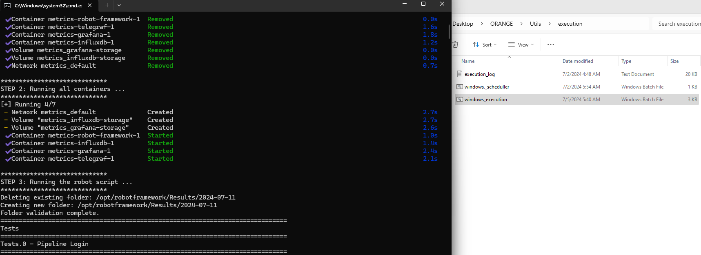

<h1>
Welcome to Orange Test Repository
</h1>

<h4>
Autor: Gabriel Martins
</h4>

<h2>
Demo website for testing:

  <a href="https://opensource-demo.orangehrmlive.com/web/index.php/auth/login">Orange HRM</a>

</h2>

## Introduction

This project was developed with the aim of applying and consolidating essential software testing concepts, such as the integration of tests with Jira, automated functional tests, and the generation of dashboards to facilitate the analysis and understanding of the evolution of tests over time. The next step would be to add performance tests and monitor the test environment, which are still in the planning phase.

In this repository, all the steps for installation and execution will be detailed. All information related to the project will be provided, just follow the steps to replicate it in your own environment.

To facilitate the analysis and verification of what has been planned so far, images will be added to illustrate each step.

Thank you for visiting my repository!

## Workflow Diagram

The entire test script is already finalized, so you just need to follow a few installation steps and understand the code logic to run it and make any necessary changes. The goal is to allow the user to reach their own conclusions and make any adaptations they deem necessary. Alright, let's get started!

1. Instalation (windows)
   1. [Docker Desktop](https://docs.docker.com/desktop/install/windows-install/)
   2. The entire application is based on Docker, so essentially, you just need Docker Desktop running on your machine, python and some libraries. The path to docker must be set in windows_execution.bat.
   3. It's necessary a jira account and a xray plugin installed in your jira, to run windows_execution_update_jira.bat. To configure the project correctly, you need to generate an api_token for your jira, and a client_id and client_secret in Xray, to the script be able to send the results to your project. Configure all details in import_results_to_jira, and update_tests_into_jira.
2. Repositoy Overview
   1. Docs - Lirabry documentation, generated for all created keywords;
   2. Metrics - This folder contains the docker-compose file, dockerfile, grafana and influxDB backup and the script to create and restore the last volume;
   3. Resources - Contains all created robot keywords related to the project.
   4. Tests - Contains all create robot test suites
   5. Results - Robot output folder, the results will be here.
   6. Utils - Input files, Bat, Bash and python scripts.
3. Execution in Windows
   1. Go to /Orange/Utils/execution and set the variable DIRECTORY=YOUR_PATH_HERE.
   2. Than double click windows_execution.bat or windows_execution_update_jira.bat
   3. All the automation will start running.
4. Results
   1. Check the Grafana Dashboard - localhost:3000 user/password:admin/password123
   2. Each execution will generate a test report, xml and html and a video as a test evidence
   3. If you choose to execute windows_execution_update_jira.bat, the jira test plan will be updated with a test execution containing all details over the test results

## Details

First of all, let's check how they are defined and how the applications relate to each other.

> Check the repository folder

> Considering that the project is all in docker, it is possible to run in any operation system that supports Docker. However, will be exemplified here only for windows. You can see the .bat file and create a similar bash script to run on your linux machine.

> Open the Grafana Dashboard

> All tests are automatically created in Jira. A python script identify if the test case is already created in Jira using a JQL filter. If the test is not in Jira, the script uses the api to create a new one and link the test to a desired test plan. The script can also identify duplicated. This is the test repo created in Jira.

> After the robot script execution, a python script finds which test passed and failed, identify which its issue key, and create an output.json to import all the results as a Jira Test Execution Issue type. After all, the tests execution is updated as the image below.

> Check the Library Documentation

> Feel free to improve this test script!

## Next steps
This is the first part of our project. The next steps will be developed in Part Two, which includes the following plans:

* Incorporate a Jenkins container for orchestration;
* Backend tests using Robot Framework;
* Introduction of Cypress to Orange HRM;
* Jira validations using the Jira API, followed by a new dashboard with:
  * Most used test cases;
  * Obsolete tests;
  * Empty tests;
  * Number of tests by project;
  * And more...

Future Backlog:
* Gatling for performance tests;
* Postman with Newman;
* A new Gatling Dashboard;
* A new dashboard displaying machine performance and internet stability during execution;
* Kubernetes (K8s) integration.
